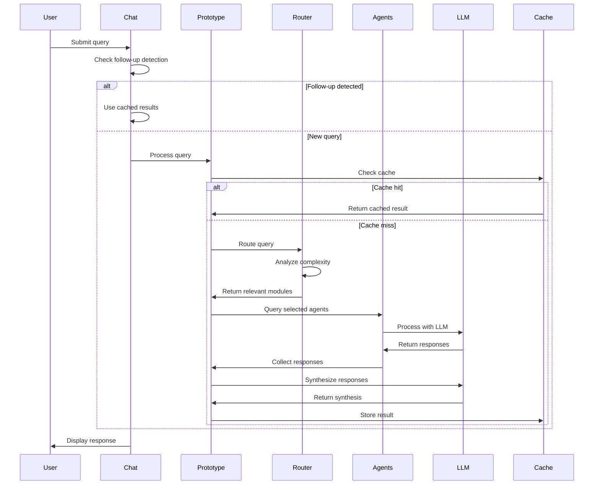
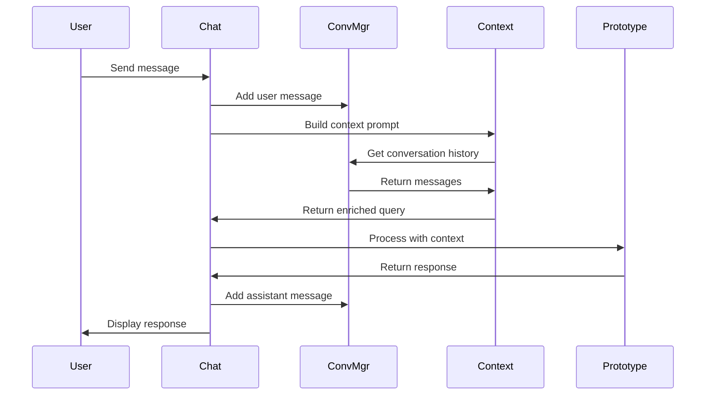

# Second Brain Prototype - Architecture Documentation

## Overview

The Second Brain Prototype is a multi-agent document synthesis system that uses LLMs
to process and query educational content. The system follows a modular architecture
with clear separation of concerns, designed for scalability, cost optimization, and
performance.

## Table of Contents

1. [System Architecture](#system-architecture)
2. [Component Architecture](#component-architecture)
3. [Data Flow](#data-flow)
4. [Configuration Management](#configuration-management)
5. [Performance Characteristics](#performance-characteristics)
6. [Error Handling & Resilience](#error-handling--resilience)
7. [Security Considerations](#security-considerations)
8. [Development Guidelines](#development-guidelines)

---

## System Architecture

### High-Level Architecture Diagram

<!-- markdownlint-disable MD013 -->
```text
┌─────────────────────────────────────────────────────────────────────────────┐
│                           SECOND BRAIN PROTOTYPE                            │
├─────────────────────────────────────────────────────────────────────────────┤
│                                                                             │
│  ┌─────────────────┐    ┌─────────────────┐    ┌─────────────────────────┐  │
│  │   Entry Points  │    │  Core System    │    │     Data Layer          │  │
│  │                 │    │                 │    │                         │  │
│  │ • prototype.py  │    │ • ModelConfig   │    │ • DocumentLoader        │  │
│  │ • interactive_  │    │ • PromptManager │    │ • CourseModuleLoader    │  │
│  │   session.py    │    │ • CacheManager  │    │ • QueryLogger           │  │
│  │ • debug_commands│    │ • QueryLogger   │    │ • SemanticCache         │  │
│  └─────────────────┘    └─────────────────┘    └─────────────────────────┘  │
│           │                       │                       │                  │
│           └───────────────────────┼───────────────────────┘                  │
│                                   │                                          │
│  ┌─────────────────────────────────┼─────────────────────────────────────────┐  │
│  │                    AGENT LAYER                                            │  │
│  │                                                                           │  │
│  │  ┌─────────────┐  ┌─────────────┐  ┌─────────────┐  ┌─────────────┐      │  │
│  │  │RoutingAgent │  │DocumentAgent│  │ModuleAgent  │  │SynthesisAgent│      │  │
│  │  │             │  │             │  │             │  │             │      │  │
│  │  │• QueryType  │  │• Single doc │  │• Module mgmt│  │• Multi-agent│      │  │
│  │  │• Complexity │  │• Multi-doc  │  │• Chunking   │  │• Synthesis  │      │  │
│  │  │• Routing    │  │• Context    │  │• Search     │  │• Integration│      │  │
│  │  └─────────────┘  └─────────────┘  └─────────────┘  └─────────────┘      │  │
│  └───────────────────────────────────────────────────────────────────────────┘  │
│                                   │                                          │
│  ┌─────────────────────────────────┼─────────────────────────────────────────┐  │
│  │                    UTILITY LAYER                                          │  │
│  │                                                                           │  │
│  │  ┌─────────────┐  ┌─────────────┐  ┌─────────────┐  ┌─────────────┐      │  │
│  │  │Summarizer   │  │Evaluator    │  │Embedding    │  │Test Suite   │      │  │
│  │  │             │  │             │  │Router       │  │             │      │  │
│  │  │• Module     │  │• Query      │  │• Semantic   │  │• Unit tests │      │  │
│  │  │  summaries  │  │  evaluation │  │  routing    │  │• Integration│      │  │
│  │  │• Content    │  │• Performance │  │• Vector     │  │• Advanced   │      │  │
│  │  │  analysis   │  │  metrics    │  │  search     │  │  features   │      │  │
│  │  └─────────────┘  └─────────────┘  └─────────────┘  └─────────────┘      │  │
│  └───────────────────────────────────────────────────────────────────────────┘  │
└─────────────────────────────────────────────────────────────────────────────────┘
```
<!-- markdownlint-enable MD013 -->

### Detailed Component Architecture

```mermaid
graph TB
    %% User Interface Layer
    subgraph "User Interface Layer"
        UI[Interactive CLI]
        CHAT[Chat Interface]
        WEB[Web Interface - Future]
    end

    %% Core System Layer
    subgraph "Core System Layer"
        PROTOTYPE[SecondBrainPrototype]
        SESSION[InteractiveSession]
        CONFIG[ModelConfig]
        PROMPTS[PromptManager]
        CACHE[CacheManager]
        LOGGER[QueryLogger]
    end

    %% Agent Layer
    subgraph "Agent Layer"
        ROUTING[RoutingAgent]
        DOC_AGENT[DocumentAgent]
        MODULE_AGENT[ModuleAgent]
        SYNTHESIS[SynthesisAgent]
        BASE_AGENT[BaseAgent]
    end

    %% Data Processing Layer
    subgraph "Data Processing Layer"
        DOC_LOADER[DocumentLoader]
        COURSE_LOADER[CourseModuleLoader]
        SUMMARIZER[ModuleSummarizer]
        EMBEDDING[EmbeddingRouter]
        SEMANTIC[SemanticCache]
    end

    %% Conversation Management
    subgraph "Conversation Management"
        CONV_MGR[ConversationManager]
        CONTEXT[Context Builder]
        FOLLOWUP[Follow-up Detection]
    end

    %% External Services
    subgraph "External Services"
        ANTHROPIC[Anthropic Claude]
        GOOGLE[Google Gemini]
        VECTOR_DB[Vector Database]
    end

    %% Data Storage
    subgraph "Data Storage"
        DOCS[Documents]
        LOGS[Query Logs]
        CACHE_DATA[Cache Data]
        CONV_DATA[Conversation Data]
    end

    %% Connections
    UI --> SESSION
    CHAT --> PROTOTYPE
    SESSION --> PROTOTYPE

    PROTOTYPE --> ROUTING
    PROTOTYPE --> DOC_AGENT
    PROTOTYPE --> MODULE_AGENT
    PROTOTYPE --> SYNTHESIS

    ROUTING --> BASE_AGENT
    DOC_AGENT --> BASE_AGENT
    MODULE_AGENT --> BASE_AGENT
    SYNTHESIS --> BASE_AGENT

    BASE_AGENT --> ANTHROPIC
    BASE_AGENT --> GOOGLE

    DOC_LOADER --> DOCS
    COURSE_LOADER --> DOCS
    SUMMARIZER --> EMBEDDING
    EMBEDDING --> VECTOR_DB
    SEMANTIC --> VECTOR_DB

    CHAT --> CONV_MGR
    CONV_MGR --> CONTEXT
    CONTEXT --> FOLLOWUP

    PROTOTYPE --> CACHE
    PROTOTYPE --> LOGGER
    PROTOTYPE --> CONFIG
    PROTOTYPE --> PROMPTS

    LOGGER --> LOGS
    CACHE --> CACHE_DATA
    CONV_MGR --> CONV_DATA
```



---

## Component Architecture

### 1. Entry Points

#### `prototype.py` (Main Entry Point)

- **Purpose**: Main application entry point and orchestration
- **Key Classes**:
  - `SecondBrainPrototype`: Core system class
  - `SimpleCache`: In-memory caching
  - `QueryLogger`: Query logging functionality
- **Functions**:
  - `main()`: Application entry point
  - `interactive_mode()`: Interactive CLI mode
  - `run_test_queries()`: Testing functionality
  - `run_scale_test()`: Performance testing

#### `interactive_session.py` (Interactive CLI)

- **Purpose**: Interactive command-line interface
- **Key Class**: `InteractiveSession` (inherits from `cmd.Cmd`)
- **Features**:
  - Command parsing and execution
  - Session state management
  - Real-time query processing
  - Cost tracking and reporting
- **Commands**: `/load`, `/query`, `/chat`, `/stats`, `/exit`

#### `chat_interface.py` (Chat Interface)

- **Purpose**: Conversational interface with context awareness
- **Key Features**:
  - Conversation history management
  - Context-aware query building
  - Follow-up question detection
  - Intelligent caching for follow-ups
- **Conversation Flow**: User input → Context building → Routing → Response

#### `debug_commands.py`

- **Purpose**: Debugging utilities and commands
- **Features**: Development and testing helpers

### 2. Core System Components

#### `model_config.py`

- **Purpose**: Model configuration and cost management
- **Key Classes**:
  - `ModelInfo`: Model metadata (cost, context window, provider)
  - `ModelConfig`: Model selection and cost tracking
- **Features**:
  - Support for Anthropic and Google models
  - Cost estimation per agent type
  - Model switching capabilities
- **Supported Models**:
  - Anthropic Claude (claude-3-opus, claude-3-sonnet)
  - Google Gemini (gemini-1.5-flash, gemini-1.5-pro)

#### `prompt_manager.py`

- **Purpose**: System prompt management
- **Key Class**: `PromptManager`
- **Features**:
  - Dynamic prompt loading from markdown files
  - Fallback to default prompts
  - Prompt caching and reloading
  - Custom prompt path configuration
  - Hot-reloading capability

#### `cache_manager.py`

- **Purpose**: Caching system for query results
- **Features**: Simple in-memory caching with statistics

#### `query_logger.py`

- **Purpose**: Query logging and analytics
- **Features**: JSON-based logging with timestamps

### 3. Agent Layer

#### `agents/base_agent.py`

- **Purpose**: Common functionality for all agents
- **Features**:
  - LLM interaction abstraction
  - Cost and token tracking
  - Error handling and retry logic
  - Model provider switching

#### `agents/routing_agent.py`

- **Purpose**: Intelligent query routing and complexity analysis
- **Key Classes**:
  - `QueryType`: Enum for query complexity levels
  - `RoutingAgent`: Main routing logic
- **Query Types**:
  - `SIMPLE`: Single fact lookup
  - `SINGLE_MODULE`: Within one module
  - `CROSS_MODULE`: Across modules
  - `SYNTHESIS`: Complex reasoning
- **Features**:
  - Query complexity analysis
  - Module relevance determination
  - Cost estimation for routing decisions
  - Content-based relevance scoring

#### `agents/document_agent.py`

- **Purpose**: Document-level query processing
- **Key Classes**:
  - `DocumentAgent`: Single/multi-document processing
  - `SynthesisAgent`: Multi-agent response synthesis
- **Features**:
  - Single document querying
  - Multi-document processing
  - Context-aware responses
  - Source attribution
  - Cost tracking per query
  - Response synthesis across agents

#### `agents/module_agent.py`

- **Purpose**: Course module management
- **Key Class**: `ModuleAgent`
- **Features**:
  - Semantic document chunking
  - Chunk-based search
  - Module-level query processing
  - Content organization

### 4. Data Processing Layer

#### Document Loaders

- **DocumentLoader** (`loaders/document_loader.py`): Generic document loading
- **CourseModuleLoader** (`loaders/course_loader.py`): Course-specific organization
- **Supported Formats**: TXT, PDF, MD files
- **Features**: Recursive loading, error handling, metadata extraction

#### Advanced Features

- **ModuleSummarizer** (`summarizer.py`): Automatic module summarization
- **EmbeddingRouter** (`embedding_router.py`): Semantic routing using embeddings
- **SemanticCache** (`semantic_cache.py`): Content-aware caching
- **QueryEvaluator** (`evaluation_framework.py`): Response quality evaluation

### 5. Conversation Management

#### Conversation Manager (`conversation_manager.py`)

- **Purpose**: Conversation state and persistence
- **Features**:
  - Message history management
  - Context window building
  - Token counting and limits
  - Conversation export/import

#### Context Building

- **Strategy**: Recent, important, or hybrid context selection
- **Token Management**: Automatic context truncation
- **Metadata**: Cost, timing, and routing information

#### Follow-up Detection

- **Intelligent Detection**: LLM-based intent classification (proposed)
- **Current Implementation**: Keyword-based pattern matching
- **Caching**: Reuse previous results for follow-ups

### 6. Configuration and Data

#### `prompts/` Directory

- `document_agent_single.md`: Single document agent prompts
- `document_agent_multi.md`: Multi-document agent prompts
- `module_agent.md`: Module agent prompts
- `synthesis_agent.md`: Synthesis agent prompts

#### `classes/` Directory

- Course content organized by institution and course
- Structured document hierarchy

---

## Data Flow

### Query Processing Flow



### Conversation Flow



### High-Level Data Flow

```text
User Query → InteractiveSession → RoutingAgent → [DocumentAgent/ModuleAgent] →
SynthesisAgent → Response
     ↓              ↓                ↓                    ↓                    ↓
QueryLogger → CacheManager → ModelConfig → PromptManager → Cost Tracking
```

---

## Configuration Management

### Environment Variables

```bash
# API Keys
ANTHROPIC_API_KEY=your_anthropic_key
GOOGLE_API_KEY=your_google_key

# Model Configuration
DEFAULT_DOCUMENT_MODEL=gemini-1.5-flash
DEFAULT_SYNTHESIS_MODEL=claude-3-opus-20240229
DEFAULT_ROUTING_MODEL=claude-3-sonnet-20240229

# System Configuration
MAX_CONTEXT_TOKENS=8000
CACHE_ENABLED=true
LOG_LEVEL=INFO
```

### Model Configuration

```python
# Model costs per 1M tokens
MODEL_COSTS = {
    "claude-3-opus-20240229": {"input": 15.0, "output": 75.0},
    "claude-3-sonnet-20240229": {"input": 3.0, "output": 15.0},
    "gemini-1.5-flash": {"input": 0.075, "output": 0.30},
    "gemini-1.5-pro": {"input": 3.5, "output": 10.5}
}
```

---

## Performance Characteristics

### Cost Optimization

- **Routing Efficiency**: 40-60% cost reduction for simple queries
- **Caching**: 30-50% reduction for repeated queries
- **Module Limits**: Dynamic limits based on query complexity
- **Model Selection**: Cost-effective models for document processing

### Response Times

- **Simple Queries**: 2-5 seconds
- **Complex Queries**: 10-30 seconds
- **Follow-up Queries**: 0.5-2 seconds (cached)
- **Routing Overhead**: <1 second

### Scalability

- **Document Count**: Tested with 100+ documents
- **Module Count**: Supports unlimited modules
- **Context Window**: Configurable up to 32K tokens
- **Concurrent Users**: Single-user system (multi-user ready)

### Performance Features

- **In-memory caching**: For query results
- **Semantic caching**: For similar queries
- **Cost tracking**: And optimization
- **Parallel processing**: Capabilities
- **Query complexity**: Estimation

---

## Error Handling & Resilience

### Error Categories

1. **API Errors**: Rate limits, authentication, network issues
2. **File System Errors**: Missing files, permission issues
3. **Model Errors**: Invalid responses, token limits
4. **Configuration Errors**: Missing API keys, invalid settings

### Recovery Strategies

- **Retry Logic**: Exponential backoff for API calls
- **Fallback Models**: Automatic model switching
- **Graceful Degradation**: Partial responses when possible
- **Error Logging**: Comprehensive error tracking

### Error Handling Features

- **Graceful degradation**: For missing files
- **Fallback prompts**: When custom prompts unavailable
- **Comprehensive logging**: And error reporting
- **Cache invalidation**: And recovery

---

## Security Considerations

### Data Privacy

- **Local Processing**: All data processed locally
- **No Data Retention**: Optional conversation persistence
- **API Key Security**: Environment variable storage
- **Content Filtering**: No sensitive data in logs

### Access Control

- **Single User**: Current implementation
- **Session Management**: Conversation isolation
- **Resource Limits**: Token and cost limits
- **Audit Trail**: Query logging for debugging

---

## Key Design Patterns

1. **Multi-Agent Architecture**: Specialized agents for different tasks
2. **Strategy Pattern**: Different routing strategies based on query type
3. **Factory Pattern**: Model instantiation based on configuration
4. **Observer Pattern**: Cost tracking and logging
5. **Command Pattern**: Interactive session command handling

---

## Development Guidelines

### Code Organization

- **Modular Design**: Clear separation of concerns
- **Type Hints**: Comprehensive type annotations
- **Error Handling**: Graceful error management
- **Documentation**: Inline and external documentation
- **Testing**: Unit and integration tests

### Best Practices

- **Configuration Management**: Environment-based configuration
- **Logging**: Structured logging with levels
- **Caching**: Multi-level caching strategy
- **Monitoring**: Performance and cost tracking
- **Security**: Input validation and sanitization

---

## Future Enhancements

### Planned Features

1. **Web Interface**: Browser-based UI
2. **Multi-User Support**: User authentication and isolation
3. **Advanced Routing**: Machine learning-based routing
4. **Real-time Collaboration**: Shared conversations
5. **Plugin System**: Extensible agent architecture

### Performance Improvements

1. **Vector Database**: Persistent embedding storage
2. **Streaming Responses**: Real-time response generation
3. **Parallel Processing**: Concurrent agent execution
4. **Distributed Caching**: Redis-based caching
5. **Load Balancing**: Multiple LLM provider support

---

## Conclusion

The Second Brain Prototype demonstrates a sophisticated multi-agent
architecture for intelligent document synthesis. The system successfully
balances performance, cost, and functionality while providing a
foundation for future enhancements. The modular design allows for
easy extension and customization, making it suitable for various document
processing applications.

The architecture provides:

- **Scalability**: Handles large document corpora efficiently
- **Cost Optimization**: Intelligent routing and caching
- **Performance**: Fast response times with quality results
- **Extensibility**: Easy to add new features and agents
- **Reliability**: Robust error handling and recovery
