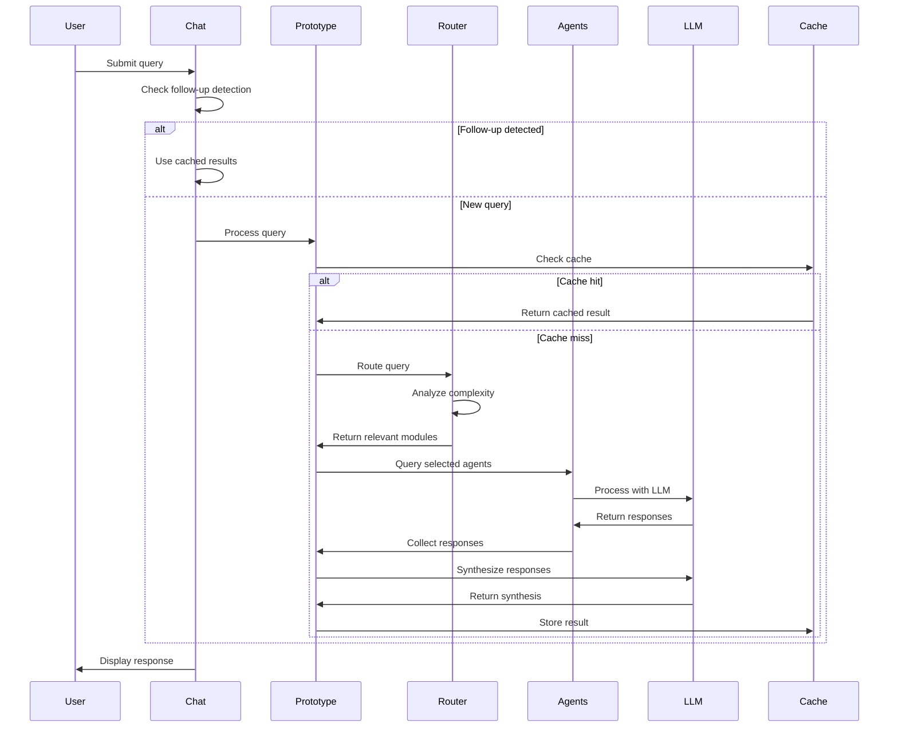
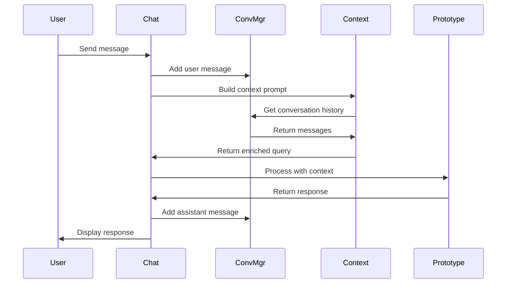

```mermaid
graph TB
    %% User Interface Layer
    subgraph "User Interface Layer"
        UI[Interactive CLI]
        CHAT[Chat Interface]
        WEB[Web Interface - Future]
    end

    %% Core System Layer
    subgraph "Core System Layer"
        PROTOTYPE[SecondBrainPrototype]
        SESSION[InteractiveSession]
        CONFIG[ModelConfig]
        PROMPTS[PromptManager]
        CACHE[CacheManager]
        LOGGER[QueryLogger]
    end

    %% Agent Layer
    subgraph "Agent Layer"
        ROUTING[RoutingAgent]
        DOC_AGENT[DocumentAgent]
        MODULE_AGENT[ModuleAgent]
        SYNTHESIS[SynthesisAgent]
        BASE_AGENT[BaseAgent]
    end

    %% Data Processing Layer
    subgraph "Data Processing Layer"
        DOC_LOADER[DocumentLoader]
        COURSE_LOADER[CourseModuleLoader]
        SUMMARIZER[ModuleSummarizer]
        EMBEDDING[EmbeddingRouter]
        SEMANTIC[SemanticCache]
    end

    %% Conversation Management
    subgraph "Conversation Management"
        CONV_MGR[ConversationManager]
        CONTEXT[Context Builder]
        FOLLOWUP[Follow-up Detection]
    end

    %% External Services
    subgraph "External Services"
        ANTHROPIC[Anthropic Claude]
        GOOGLE[Google Gemini]
        VECTOR_DB[Vector Database]
    end

    %% Data Storage
    subgraph "Data Storage"
        DOCS[Documents]
        LOGS[Query Logs]
        CACHE_DATA[Cache Data]
        CONV_DATA[Conversation Data]
    end

    %% Connections
    UI --> SESSION
    CHAT --> PROTOTYPE
    SESSION --> PROTOTYPE

    PROTOTYPE --> ROUTING
    PROTOTYPE --> DOC_AGENT
    PROTOTYPE --> MODULE_AGENT
    PROTOTYPE --> SYNTHESIS

    ROUTING --> BASE_AGENT
    DOC_AGENT --> BASE_AGENT
    MODULE_AGENT --> BASE_AGENT
    SYNTHESIS --> BASE_AGENT

    BASE_AGENT --> ANTHROPIC
    BASE_AGENT --> GOOGLE

    DOC_LOADER --> DOCS
    COURSE_LOADER --> DOCS
    SUMMARIZER --> EMBEDDING
    EMBEDDING --> VECTOR_DB
    SEMANTIC --> VECTOR_DB

    CHAT --> CONV_MGR
    CONV_MGR --> CONTEXT
    CONTEXT --> FOLLOWUP

    PROTOTYPE --> CACHE
    PROTOTYPE --> LOGGER
    PROTOTYPE --> CONFIG
    PROTOTYPE --> PROMPTS

    LOGGER --> LOGS
    CACHE --> CACHE_DATA
    CONV_MGR --> CONV_DATA
```

## Detailed Component Architecture

### 1. User Interface Layer

#### Interactive CLI (`interactive_session.py`)
- **Purpose**: Command-line interface for system interaction
- **Key Features**:
  - Command parsing and execution
  - Session state management
  - Real-time query processing
  - Cost tracking and reporting
- **Commands**: `/load`, `/query`, `/chat`, `/stats`, `/exit`

#### Chat Interface (`chat_interface.py`)
- **Purpose**: Conversational interface with context awareness
- **Key Features**:
  - Conversation history management
  - Context-aware query building
  - Follow-up question detection
  - Intelligent caching for follow-ups
- **Conversation Flow**: User input → Context building → Routing → Response

### 2. Core System Layer

#### SecondBrainPrototype (`prototype.py`)
- **Purpose**: Main orchestrator and system coordinator
- **Key Responsibilities**:
  - Agent lifecycle management
  - Query routing and execution
  - Response synthesis
  - Cost and performance tracking
- **Core Methods**:
  - `add_document()`: Add individual document agents
  - `add_module()`: Add module-based agents
  - `query()`: Execute queries across all agents
  - `query_with_routing()`: Intelligent routing-based queries

#### Model Configuration (`model_config.py`)
- **Purpose**: LLM model management and cost tracking
- **Supported Models**:
  - Anthropic Claude (claude-3-opus, claude-3-sonnet)
  - Google Gemini (gemini-1.5-flash, gemini-1.5-pro)
- **Cost Tracking**: Per-model token costs and usage statistics

#### Prompt Management (`prompt_manager.py`)
- **Purpose**: Dynamic prompt loading and management
- **Features**:
  - Markdown-based prompt files
  - Fallback to default prompts
  - Hot-reloading capability
  - Custom prompt path configuration

### 3. Agent Layer

#### Base Agent (`agents/base_agent.py`)
- **Purpose**: Common functionality for all agents
- **Features**:
  - LLM interaction abstraction
  - Cost and token tracking
  - Error handling and retry logic
  - Model provider switching

#### Routing Agent (`agents/routing_agent.py`)
- **Purpose**: Intelligent query routing and complexity analysis
- **Query Types**:
  - `SIMPLE`: Single fact lookup
  - `SINGLE_MODULE`: Within one module
  - `CROSS_MODULE`: Across modules
  - `SYNTHESIS`: Complex reasoning
- **Routing Strategy**: Content-based relevance scoring

#### Document Agent (`agents/document_agent.py`)
- **Purpose**: Individual document processing
- **Features**:
  - Single document querying
  - Multi-document processing
  - Context-aware responses
  - Source attribution

#### Module Agent (`agents/module_agent.py`)
- **Purpose**: Course module management
- **Features**:
  - Semantic document chunking
  - Chunk-based search
  - Module-level query processing
  - Content organization

#### Synthesis Agent (`agents/document_agent.py`)
- **Purpose**: Multi-agent response synthesis
- **Features**:
  - Response combination and integration
  - Conflict resolution
  - Source attribution
  - Coherent narrative generation

### 4. Data Processing Layer

#### Document Loaders
- **DocumentLoader** (`loaders/document_loader.py`): Generic document loading
- **CourseModuleLoader** (`loaders/course_loader.py`): Course-specific organization
- **Supported Formats**: TXT, PDF, MD files
- **Features**: Recursive loading, error handling, metadata extraction

#### Advanced Features
- **ModuleSummarizer** (`summarizer.py`): Automatic module summarization
- **EmbeddingRouter** (`embedding_router.py`): Semantic routing using embeddings
- **SemanticCache** (`semantic_cache.py`): Content-aware caching
- **QueryEvaluator** (`evaluation_framework.py`): Response quality evaluation

### 5. Conversation Management

#### Conversation Manager (`conversation_manager.py`)
- **Purpose**: Conversation state and persistence
- **Features**:
  - Message history management
  - Context window building
  - Token counting and limits
  - Conversation export/import

#### Context Building
- **Strategy**: Recent, important, or hybrid context selection
- **Token Management**: Automatic context truncation
- **Metadata**: Cost, timing, and routing information

#### Follow-up Detection
- **Intelligent Detection**: LLM-based intent classification (proposed)
- **Current Implementation**: Keyword-based pattern matching
- **Caching**: Reuse previous results for follow-ups

## Data Flow Architecture

### Query Processing Flow



### Conversation Flow



## Configuration Management

### Environment Variables
```bash
# API Keys
ANTHROPIC_API_KEY=your_anthropic_key
GOOGLE_API_KEY=your_google_key

# Model Configuration
DEFAULT_DOCUMENT_MODEL=gemini-1.5-flash
DEFAULT_SYNTHESIS_MODEL=claude-3-opus-20240229
DEFAULT_ROUTING_MODEL=claude-3-sonnet-20240229

# System Configuration
MAX_CONTEXT_TOKENS=8000
CACHE_ENABLED=true
LOG_LEVEL=INFO
```

### Model Configuration
```python
# Model costs per 1M tokens
MODEL_COSTS = {
    "claude-3-opus-20240229": {"input": 15.0, "output": 75.0},
    "claude-3-sonnet-20240229": {"input": 3.0, "output": 15.0},
    "gemini-1.5-flash": {"input": 0.075, "output": 0.30},
    "gemini-1.5-pro": {"input": 3.5, "output": 10.5}
}
```

## Performance Characteristics

### Cost Optimization
- **Routing Efficiency**: 40-60% cost reduction for simple queries
- **Caching**: 30-50% reduction for repeated queries
- **Module Limits**: Dynamic limits based on query complexity
- **Model Selection**: Cost-effective models for document processing

### Response Times
- **Simple Queries**: 2-5 seconds
- **Complex Queries**: 10-30 seconds
- **Follow-up Queries**: 0.5-2 seconds (cached)
- **Routing Overhead**: <1 second

### Scalability
- **Document Count**: Tested with 100+ documents
- **Module Count**: Supports unlimited modules
- **Context Window**: Configurable up to 32K tokens
- **Concurrent Users**: Single-user system (multi-user ready)

## Error Handling & Resilience

### Error Categories
1. **API Errors**: Rate limits, authentication, network issues
2. **File System Errors**: Missing files, permission issues
3. **Model Errors**: Invalid responses, token limits
4. **Configuration Errors**: Missing API keys, invalid settings

### Recovery Strategies
- **Retry Logic**: Exponential backoff for API calls
- **Fallback Models**: Automatic model switching
- **Graceful Degradation**: Partial responses when possible
- **Error Logging**: Comprehensive error tracking

## Security Considerations

### Data Privacy
- **Local Processing**: All data processed locally
- **No Data Retention**: Optional conversation persistence
- **API Key Security**: Environment variable storage
- **Content Filtering**: No sensitive data in logs

### Access Control
- **Single User**: Current implementation
- **Session Management**: Conversation isolation
- **Resource Limits**: Token and cost limits
- **Audit Trail**: Query logging for debugging

## Future Enhancements

### Planned Features
1. **Web Interface**: Browser-based UI
2. **Multi-User Support**: User authentication and isolation
3. **Advanced Routing**: Machine learning-based routing
4. **Real-time Collaboration**: Shared conversations
5. **Plugin System**: Extensible agent architecture

### Performance Improvements
1. **Vector Database**: Persistent embedding storage
2. **Streaming Responses**: Real-time response generation
3. **Parallel Processing**: Concurrent agent execution
4. **Distributed Caching**: Redis-based caching
5. **Load Balancing**: Multiple LLM provider support

## Development Guidelines

### Code Organization
- **Modular Design**: Clear separation of concerns
- **Type Hints**: Comprehensive type annotations
- **Error Handling**: Graceful error management
- **Documentation**: Inline and external documentation
- **Testing**: Unit and integration tests

### Best Practices
- **Configuration Management**: Environment-based configuration
- **Logging**: Structured logging with levels
- **Caching**: Multi-level caching strategy
- **Monitoring**: Performance and cost tracking
- **Security**: Input validation and sanitization

## Conclusion

The Second Brain Prototype demonstrates a sophisticated multi-agent architecture for intelligent document synthesis. The system successfully balances performance, cost, and functionality while providing a foundation for future enhancements. The modular design allows for easy extension and customization, making it suitable for various document processing applications.